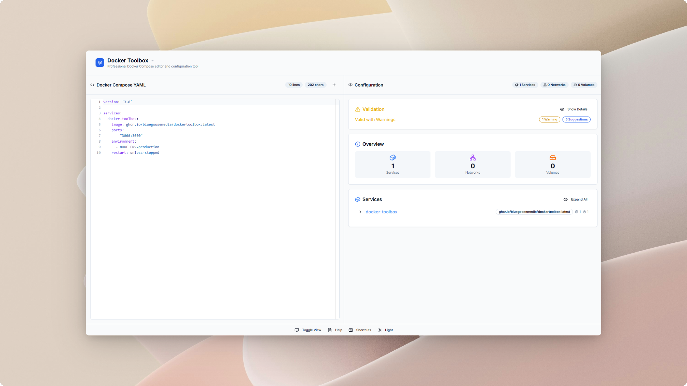
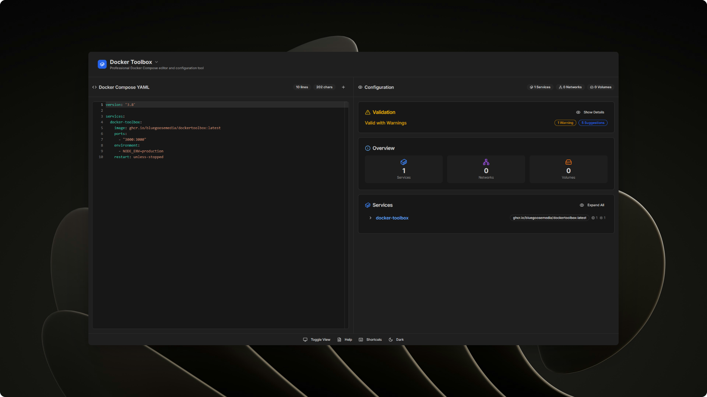

# ComposeToolbox

ComposeToolbox is a self-hostable web application that allows users to edit, validate, and get suggestions for their docker-compose.yml files. It has a fully featured code editor as well as a configuration panel that breaks down what exactly the files does.




## Features

- Validate your Docker-Compose files
- See a breakdown of what the compose configuration does
- Edit docker-compose.yml files
- Get suggestions for how to improve your compose files

---

## Running the Application

### Prerequisites

- Docker
- Docker Compose

### Instructions

1. Create a `docker-compose.yml` file with the following content:

```yaml
version: '3.9'

services:
  composetoolbox:
    image: ghcr.io/bluegoosemedia/composetoolbox:latest
    ports:
      - "3000:3000"
    environment:
      - NODE_ENV=production
    restart: unless-stopped

```

2. Run `docker-compose up -d` to start the container.